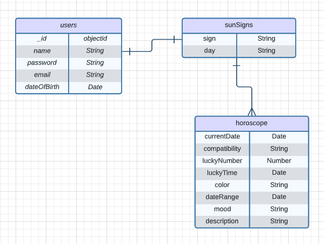
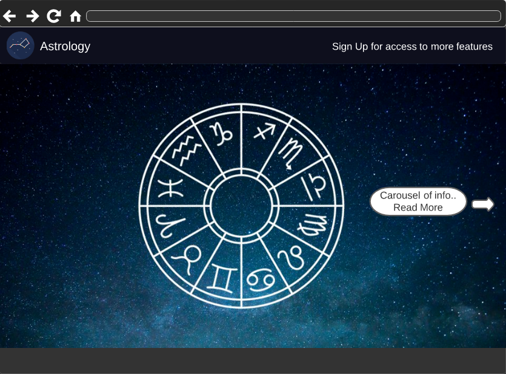
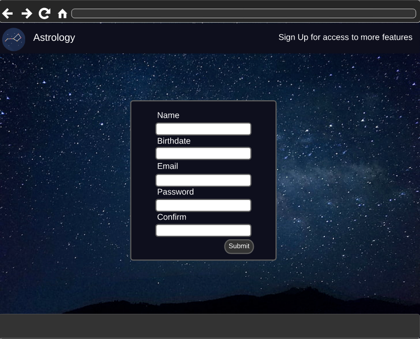
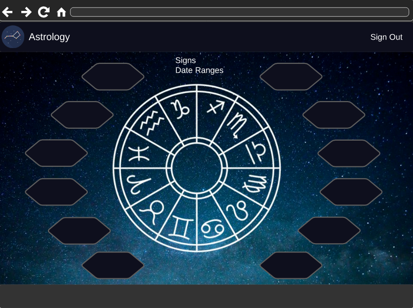

# Astrology MERN Full-Stack Application


## OVERVIEW

- The Astrology MERN Application is a full-stack application that will allow users to sign-up for more features, such as seeing a daily horoscope include yesterday's and tomorrow's, compatibility, color, mood, and many more!


### Technology

- React
- JWT
- MongoDB
- Mongoose
- Express JS
- Node JS
- HTML5
- CSS & Bootstrap
- JavaScript


## Entity Relationship Diagram




## USER STORIES

```
As a user, AAU, I want the ability to...
- sign up with my own personal information
- sign in and be able to see my daily horoscope
- see what sign I am based on my birthday
- navigate to see yesterday's, today's and tomorrow's horoscope
- check compatibility with other signs
- see today's mood/colors/lucky number
```


## Wireframes/Screenshots






## INSTRUCTIONS

- Index/public page displays information about what features that signing up would provide
- Log in to access more features
- Logged in users can


## Trello Board

[Trello](https://trello.com/b/S1HsSaO4/project-3)


## Planned future enhancements

- Implement function to include dates of pick-up, calculate due date according to day supply and refill tracker
- Add cards to allow user to keep track of physician info


## Credits

Wireframes and ERD was created using [Lucidchart](https://www.lucidchart.com/).
API used for this project was [aztro.](https://aztro.readthedocs.io/en/latest/)
